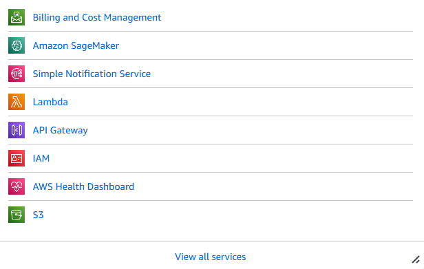

# AWS ML: Yahoo finance stock price prediction for Apple Inc. 

The steps are divided into 4 parts:
1. Build and train an Amazon SageMaker model (xgboost)
2. Deploy and test the Amazon SageMaker model endpoint
3. Create an AWS Lambda function
4. Build, deploy, and test an API Gateway endpoint for the REST API

The Python code used to perform all the above steps is shown in the Jupyter Notebook [AWS_stock_price_prediction.ipynb](https://github.com/gautampk95/upskill_projects/blob/main/Project%3A%20AWS%20Machine%20Learning%20Specialization/AWS_stock_price_prediction.ipynb). Steps 3 and 4 are primarily executed using Amazon services such as Lambda, SNS, and API Gateway. The specific services utilized in this upskill project are illustrated in the image below:



## Key details about the trained prediction model
- The data extracted/downloaded from yfincance python library for AAPL (Apple Inc.)
- Start date: (01 January 2019), End date: (01 January 2024). 
- 80% of the data as training data and 20% as testing/validation data. All are stored in the S3 bucket.
- Training model algorithm image: XGBoost container retrieved from SageMaker image URI.
- **Target variable**: Target. **Explanatory variables**: Open, High, Low, Close, Volume.

## Deployment details
**Deploy trained xgb model as Endpoints**

1. Environment:
> **Outside SageMaker - Serialization by Endpoint**
  
2. Method to invoke the endpoint
> **API - Single Prediction**

3. Data type based on method
> **API - Json**

## Test data and deployment
- Test data date: (04 January 2024) extracted from yfinance library.
- Deployment: Sending prediction result via email (SNS) using REST (API Gateway) to make a POST request

## Amazon Lambda function
The Lambda function written for the deployment
```python
import boto3

ENDPOINT_NAME = 'sagemaker-xgboost-XXXXXXXXXXXX'
runtime = boto3.client('runtime.sagemaker')
email_client = boto3.client('sns')

def lambda_handler(event, context):
    inputs = event['data']
    # for loop for multiple inference
    result = []
    for input in inputs:
        serialized_input = ','.join(map(str, input))
    
        response = runtime.invoke_endpoint(EndpointName = ENDPOINT_NAME, 
                                       ContentType = 'text/csv',
                                      Body = serialized_input)
        response = response['Body'].read().strip()
        result.append(response.decode())

    response_sns = email_client.publish(
        TopicArn = 'arn:aws:sns:eu-central-1:XXXXXXXXX',
        Message = 'Good day! The prediction/s is/are ' + str(result),
        Subject = 'Finance - Daily Prediction for Apple Inc.')
    
    return result
